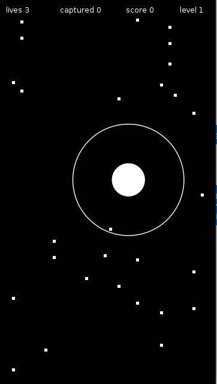

# Game - Afraid of Squares



### Linux
#### Install Lua
``` sudo apt-get install lua5.3 ```
#### Install Löve
```sudo apt-get install love```
#### Clone this repo
```git clone https://github.com/vdbalbom/gameafraidofsquares.git```
#### Run
##### If you are outside the folder:
```love gameafraidofsquares```

##### If you are inside the folder:
```love .```

### MacOs
#### Install Lua
``` brew install lua ```
#### Install Löve
```brew cask install love```
#### Clone this repo
```git clone https://github.com/vdbalbom/gameafraidofsquares.git```
#### Run
##### If you are outside the folder:
```open -n -a love "gameafraidofsquares"```
##### If you are inside the folder:
```open -n -a love "."```

### Controls
|     <b>Action</b>      | <b>Control</b> |
| ---------------------- | -------------- |
|        Move Right      |        →       |
|        Move Left       |        ←       |
|         Move Top       |        ↑       |
|        Move Down       |        ↓       |
| Grow The Attack Field* |      Space     |

\* Keep pressed to grow and drop to kill the enemies which are inside the Attack Field. Killing enemies at the same time give you more score then kill them one by one.

Created using the programming language Lua and the Game engine LÖVE.
